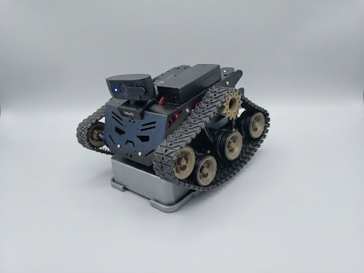
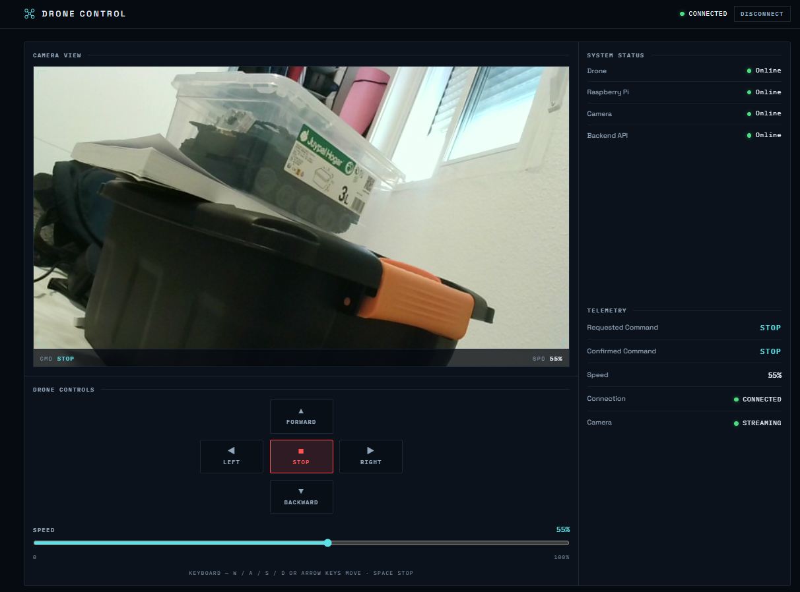

# CarDrone — Drone Control

A web application for **monitoring and controlling a small wheeled drone**: a
React dashboard, an ASP.NET Core backend, and a Raspberry Pi hardware runtime
(GPIO/PWM for the motors, a USB camera streamed as **WebRTC** for low latency,
with uStreamer MJPEG as fallback).

The same source tree runs on a **development PC** (simulated hardware) and on a
**Raspberry Pi** (real hardware). Platform differences come only from
configuration — no code branches.

> Rulebook: `AGENTS.md`. Current architecture snapshot: `docs/ARCHITECTURE.md`.
> Durable decisions: `docs/DECISIONS.md`. Task roadmap: `tasks/BACKLOG.md`.

---

## 1. What it does

- **Dashboard**: connection/system status, simulated telemetry, a **camera
  panel** (live feed on the Pi — WebRTC, with an MJPEG fallback — and simulated
  on the PC), and directional controls (forward / backward / left / right /
  stop) with **hold-to-move**, plus a speed control.
- **Real control plane** over `/api/…` (five endpoints + health): connect,
  disconnect, command, speed, status.
- **Two runtime planes that never mix** (D4): the control plane (`/api/`, JSON,
  ASP.NET) and the media plane (WebRTC via `/go2rtc/`, or MJPEG via
  `/camera/`).
- **Honest by construction**: simulated acknowledgements are never presented as
  hardware-confirmed; anything not physically verified is marked
  `NOT VERIFIED`.

## 2. Architecture

```text
Browser (React SPA)
   │  same-origin HTTP
   ▼
Frontend nginx ── /        → static React build
   ├──────────── /api/     → ASP.NET Core backend
   ├──────────── /go2rtc/  → go2rtc (WebRTC signaling)  [media plane]
   └──────────── /camera/  → uStreamer (MJPEG fallback) [media plane]
                                ▲
                                │ /dev/video0
                          Raspberry Pi Camera
```

Layers (strict boundaries — hardware knowledge stays low):

```text
React UI                presentation only; knows no GPIO/PWM/device details
   ↓  DroneService      frontend service abstraction (ApiDroneService | MockDroneService)
ASP.NET Core API        thin controllers, wire contract (camelCase, lowercase enums, ProblemDetails)
   ↓
Application             IDroneService → IDroneController (contract); DroneService orchestration
   ↓  composition root  selects ONE graph by HARDWARE_MODE (mock | dry-run | real)
Infrastructure          MockDroneController | Raspberry provider (IDroneHardware)
   ↓
Linux / Raspberry Pi    GPIO (libgpiod), PWM (sysfs), camera device
```

- **Domain** (`DroneControl.Domain`): immutable records/enums. Depends on nothing.
- **Application**: contracts + orchestration; never references hardware.
- **Infrastructure**: hardware-boundary implementations and the fail-safe
  decorator.
- **API**: HTTP surface only; no logic; controllers never touch GPIO.

### Camera pipeline

```text
USB camera → ffmpeg (H.264/libx264) → go2rtc → WebRTC (browser <video>)     [primary]
      │                                    ▲ nginx /go2rtc/ proxies the SDP signaling only
      └──── uStreamer (MJPEG) → nginx /camera/ → browser                [fallback]
```

The primary transport is **WebRTC** (browser `<video>`, ~100–200 ms): go2rtc on
the Pi transcodes the camera to H.264 (`libx264`) and serves the media directly,
while nginx proxies only the signaling same-origin (`/go2rtc/`). The MJPEG
`` over `/camera/` stays as the **automatic fallback** when WebRTC is
unavailable or stalls. Two Pi-side source modes:

- `CAMERA_SOURCE=ustreamer` (default) — uStreamer owns the camera and WebRTC is
  transcoded from its MJPEG feed, so the `/camera/` fallback stays available.
- `CAMERA_SOURCE=device` — go2rtc reads `/dev/video0` directly (lowest latency,
  no MJPEG fallback).

The browser always uses relative same-origin paths (no host/IP in React), and
the backend reports camera _status_ over the existing `DroneStatus.camera`
field — the wire contract is unchanged.

## 3. Runtime modes and deployment

Two orthogonal runtime modes, selected **only at DI composition root**:

| Key             | Values                                  | Meaning                                                                                      |
| --------------- | --------------------------------------- | -------------------------------------------------------------------------------------------- |
| `HARDWARE_MODE` | `mock` (default) \| `dry-run` \| `real` | mock = simulated; dry-run = real flow, outputs logged & suppressed; real = physical GPIO/PWM |
| `CAMERA_MODE`   | `mock` (default) \| `ustreamer`         | mock = simulated; ustreamer = real feed: WebRTC (go2rtc) with MJPEG `/camera/` fallback      |

One folder, one command: **`docker compose up`** on PC and Pi; the only
difference is the folder's `.env`. Invalid/incompatible values abort startup
loudly (no silent fallback, D5). `real` requires `linux/arm64` and, for motor
actuation, the external-failure-protection assertion (D7).

See `docs/DECISIONS.md` (D1–D8) and `docs/ARCHITECTURE.md`.

## 4. Repository layout

```text
backend/     .NET 10 solution: Domain, Application, Infrastructure, Api (+ tests)
frontend/    React + TypeScript + Vite dashboard (nginx image, /api + /camera proxies)
camera/      uStreamer container image + go2rtc.docker.yaml (WebRTC source)
docker-compose.yml             base stack (frontend, backend, ustreamer + go2rtc [profile camera])
docker-compose.raspberry.yml   Pi-only overlay (GPIO/PWM devices, camera, host-loopback port)
.env.raspberry.example         Pi configuration template
docs/        PRD, ARCHITECTURE, DECISIONS, DOCKER, RUNBOOK-PI, hardware/WIRING.md, ...
specs/       one specification per feature/task (the SDD source of truth)
scripts/     native (no-Docker) Pi launcher: run-native-pi.sh, nginx-native.conf,
             go2rtc.yaml (WebRTC source), cardrone-native.service, deploy-pi.ps1
tasks/BACKLOG.md               roadmap and task statuses
```

## 5. Running it

### Development PC (Docker)

```bash
docker compose up
# UI:  http://localhost:8081      API: http://localhost:5080
```

### Raspberry Pi (Docker Compose) — full stack

`docker compose up` on the Pi runs the **whole** application:

| Service     | Role                                                                                         |
| ----------- | -------------------------------------------------------------------------------------------- |
| `frontend`  | React SPA + nginx proxies `/api/`, `/camera/`, `/go2rtc/` (host `:8081`)                      |
| `backend`   | ASP.NET Core with **real GPIO direction and real PWM speed** (host `:5080`)                   |
| `ustreamer` | MJPEG at `/camera/` — the video **fallback** (host loopback `:8080`, not on the LAN)          |
| `go2rtc`    | H.264 transcode + **WebRTC** for the low-latency `<video>`, media on `:8555`                   |

```bash
cp .env.raspberry.example .env   # HARDWARE_MODE=real, CAMERA_MODE=ustreamer,
                                 # GPIO_*, PWM_CHIP_PATH/PWM_CHANNEL_*, GO2RTC_API_TARGET
docker compose up --build
# UI: http://<pi>:8081
```

Two details make the Pi stack match the native one:

- **PWM in the container** works because the Pi overlay bind-mounts the PWM chip
  tree at `/pwm` (outside Docker's read-only `/sys`) and points
  `Raspberry:PWM:ChipPath` there (decision D8). The asserted duty envelope lives
  in the operator's `./pwm.env` (like `./motor.env` for direction).
- **go2rtc runs with host networking** so WebRTC media is reachable at the Pi's
  real LAN IP (a bridge container only exposes `172.x`); it reads uStreamer's
  MJPEG over the host loopback and nginx proxies only the SDP signaling.

All services use `restart: unless-stopped`, so a Pi **reboot brings the stack
back up automatically** (a `docker compose down` removes the containers until the
next `up -d`).

Device/permission mappings live in `docker-compose.raspberry.yml` and must come
from the completed target inventory — nothing is invented. Step-by-step:
`docs/RUNBOOK-PI.md`.

### Raspberry Pi (native, no Docker)

Runs the whole stack directly on the host. `docker compose up` on the Pi also
delivers the full stack (frontend, backend with real GPIO + PWM, uStreamer MJPEG
and go2rtc WebRTC); use the native path for quick host-side iteration or when you
prefer not to run containers.

```bash
sudo apt-get install -y nginx ustreamer libgpiod2 ffmpeg
mkdir -p ~/bin                         # go2rtc (WebRTC) — arm64 binary
curl -sL -o ~/bin/go2rtc https://github.com/AlexxIT/go2rtc/releases/latest/download/go2rtc_linux_arm64
chmod +x ~/bin/go2rtc scripts/run-native-pi.sh
cp scripts/native.env.example native.env
sudo ./scripts/run-native-pi.sh   # nginx + uStreamer + go2rtc (WebRTC) + backend
```

**Hybrid workflow (recommended for development):** keep the source of truth and
all builds on the PC, and deploy the published artifacts to the Pi over SSH.

```powershell
# On the PC (Windows): publish linux-arm64 + build frontend + copy + restart
./scripts/deploy-pi.ps1 -PiHost 192.168.1.50
```

`scripts/deploy-pi.ps1` publishes the backend self-contained (no .NET 10 needed
on the Pi), builds the frontend same-origin, copies both to the Pi, and restarts
the native stack via `sudo -n` (see the passwordless-sudo note in
`docs/RUNBOOK-PI.md`). Use `-SkipBuild` / `-SkipRestart` to narrow its scope.

For the **Docker Compose** runtime, sync the source and rebuild the images on the
Pi with the same script:

```powershell
./scripts/deploy-pi.ps1 -PiHost 192.168.1.50 -Docker
# -SkipBuild: only `docker compose up -d`;  -SkipRestart: only sync the source
```

The two runtimes share the Pi's ports, so run one at a time.

## 6. Hardware

- Raspberry Pi 4 (a **Raspberry Pi 4 Model B, Ubuntu 22.04 arm64** on the current
  target), L298N motor driver, two DC motors, a USB camera.
- GPIO character device `/dev/gpiochip0` (BCM2711 header bank). The non-root
  container receives the `gpio` group; no `privileged` mode.
- Physical wiring, PWM limits and motor behavior are recorded in
  `docs/hardware/WIRING.md` and are **operator evidence** — never assumed.
- Verification ladder (normative): `implemented → built → mock-tested →
dry-run-tested → Pi-runtime-verified → real-hardware-verified`. Anything not
  physically exercised stays `NOT VERIFIED`.

  

## 7. Development workflow (Spec-Driven Development)

1. **`/plan-spec <task>`** creates or updates a specification only (no code).
2. **`/spec <spec>`** implements only the active specification and validates it.
3. One task at a time; the next task is never started automatically.

The specification is the source of truth. `tasks/BACKLOG.md` holds the roadmap
and statuses; each task's spec lives under `specs/`. Work proceeds in phases
(frontend → backend → hardware → camera → unified deployment → end-to-end
validation).

## 8. Status

- Implemented and mock/dry-run-tested: dashboard, backend API + simulator,
  fail-safe software supervision, dry-run mode, motor direction + PWM mapping
  (software), real GPIO sink (libgpiod), camera probe + status overlay,
  `/camera/` proxy, uStreamer container, unified compose + Pi `.env`.
- Verified on the target Pi, via **`docker compose up`** (frontend + backend
  with real GPIO **and PWM** + uStreamer + go2rtc) **and** natively
  (`scripts/run-native-pi.sh`): **low-latency WebRTC camera** (ffmpeg H.264 →
  go2rtc, with a stall watchdog and MJPEG fallback), the MJPEG `/camera/`
  pipeline, GPIO container access (non-root), **real GPIO motor direction** (all
  five commands operator-confirmed), **variable speed via PWM** (ENA/ENB on
  BCM 12/13 at 20 kHz; speeds 25/60/100 operator-confirmed) and the hybrid
  PC→Pi deploy (`scripts/deploy-pi.ps1`).
- `NOT VERIFIED` (deferred / needs hardware evidence): PWM minimum-duty
  threshold and duty-0 rest/coast/brake behavior, electrical limits, full Pi
  runtime sign-off. See `docs/hardware/WIRING.md`.

## 9. Development tooling (OpenCode + skills)

CarDrone is built with **[OpenCode](https://opencode.ai)**, an agentic coding
harness, driven by project-local **skills** and slash commands rather than
ad-hoc prompting. Code is produced through the Spec-Driven Development workflow
(§7).

Skills actually used on this project (kept under `.agents/skills/` and
`.opencode/commands/skills/`):

| Skill                     | Used for                                                                                                             |
| ------------------------- | -------------------------------------------------------------------------------------------------------------------- |
| `spec-driven-development` | the workflow itself — `/plan-spec` → `/spec` → validate; backlog lifecycle; `NOT VERIFIED` / `BLOCKED` honesty rules |
| `dotnet`                  | C# / ASP.NET Core conventions — layering, DI composition, configuration, xUnit tests                                 |
| `docker`                  | multi-stage images, `.dockerignore`, Compose, arm64 builds, orchestrator-level health probes                         |
| `raspberry-pi`            | Pi runtime — GPIO/PWM, camera/uStreamer, Linux device access, hardware permissions                                   |
| `react`                   | React + TypeScript UI patterns and component structure                                                               |
| `frontend-design`         | visual design direction for the dashboard                                                                            |
| `web-design-guidelines`   | UI/accessibility review of the dashboard                                                                             |

### Commands (`.opencode/commands/`)

The day-to-day workflow is driven by project commands kept in
**`.opencode/commands/`** (the `skills/` subfolder holds the prompt-side skill
descriptions):

| Command          | File                                                      | What it does                                                                                                                     |
| ---------------- | --------------------------------------------------------- | -------------------------------------------------------------------------------------------------------------------------------- |
| `/plan-spec`     | [`plan-spec.md`](.opencode/commands/plan-spec.md)         | create or update a **specification only** — no code                                                                              |
| `/spec`          | [`spec.md`](.opencode/commands/spec.md)                   | implement exactly **one** active specification and validate it                                                                   |
| `/audit-docs`    | [`audit-docs.md`](.opencode/commands/audit-docs.md)       | **audit** documentation against the backlog, specs, commands and skills; flag contradictions and rules living in the wrong place |
| `/optimize-docs` | [`optimize-docs.md`](.opencode/commands/optimize-docs.md) | **optimize** the specs and docs — consolidate, remove duplication, and realign with the skills                                   |

`/plan-spec` and `/spec` drive implementation; `/audit-docs` and
`/optimize-docs` were used to audit and optimize the specification set and the
documentation, keeping them consistent and lean.

The agent selects the **minimum set** of skills that the task's domain requires
— skills define _how_, the specification defines _what_.

## 10. Documentation map

- `AGENTS.md` — project rules, boundaries, workflow (start here)
- `MEMORY.md` — durable state and lessons learned
- `docs/PRD.md` — product requirements
- `docs/ARCHITECTURE.md` — architecture and status snapshot
- `docs/DECISIONS.md` — decision records D1–D8 (D8 = container PWM via a bind mount outside `/sys`)
- `docs/DOCKER.md` — container build/run commands
- `docs/RUNBOOK-PI.md` — bring-up runbook for the Raspberry Pi
- `docs/hardware/WIRING.md` / `raspberry-pi-inventory.md` — hardware evidence
- `scripts/run-native-pi.sh` — native (no-Docker) full-stack launcher
- `tasks/BACKLOG.md` — roadmap and task statuses
- `specs/` — one specification per feature/task

## User Interface


